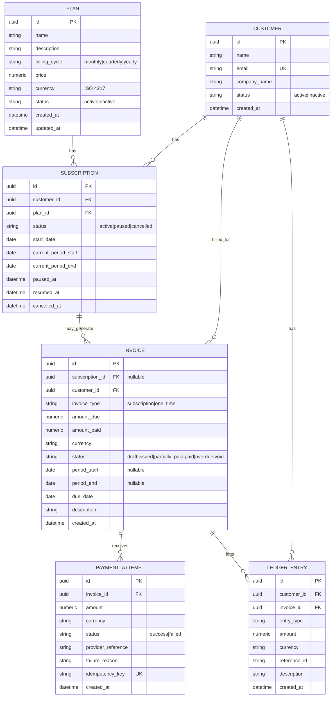
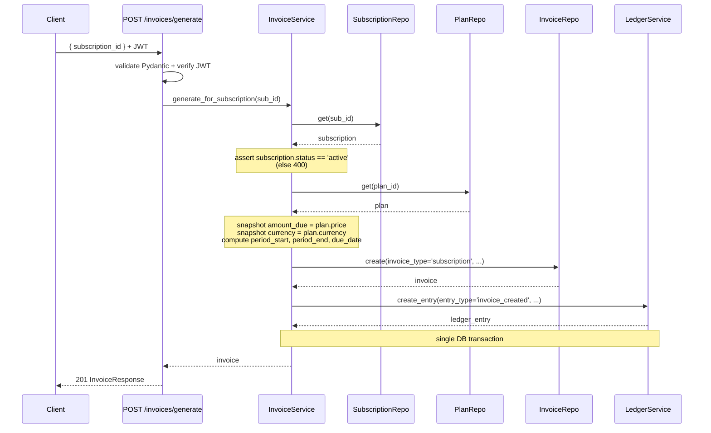
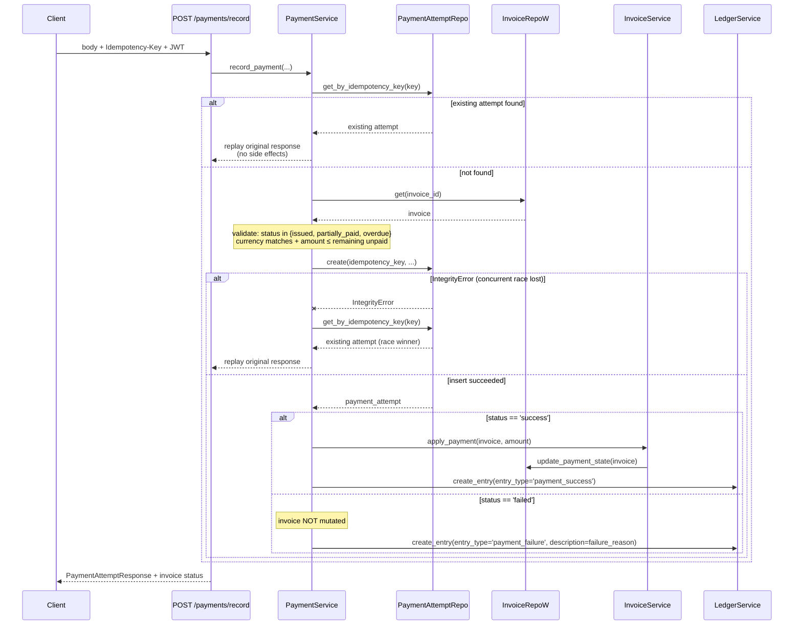

# SubLedger — Design Document

*Low-level design for a FastAPI subscription-billing backend. Submitted as part of the Airtribe Backend Engineering assignment, June 27, 2026.*

---

## 1. Overview

SubLedger is a billing API that manages plans, customers, subscriptions, invoices, payments, and an append-only ledger. The brief asks for subscription-driven billing; this implementation extends the domain model to also handle one-time invoices, while keeping all the brief's mandated endpoints intact. The system runs as a Docker Compose stack: FastAPI web service, PostgreSQL 18, Redis, Celery worker and Celery Beat. PostgreSQL is required (not SQLite) because the design depends on a partial unique index, a CHECK constraint, and a UNIQUE constraint that gates the idempotency mechanism.

The architecture is **Repository Pattern + Service Layer** with FastAPI dependency injection. Routes are thin: they validate input via Pydantic, call into a service, and return a Pydantic response. Services own business rules and orchestrate across repositories within a single SQLAlchemy transaction. Repositories own all database access. This separation is the primary thing the brief is grading for, and it's also what makes the test suite (29 tests, six categories) cheap to write.

---

## 2. Entity Relationship Diagram



**Schema-level invariants** (enforced in the database, not just the service layer):

- `customer.email` is UNIQUE.
- A partial unique index `(customer_id, plan_id) WHERE status = 'active'` on `subscription` prevents duplicate active subscriptions for the same (customer, plan) pair.
- A CHECK constraint on `invoice` enforces:
  `(invoice_type = 'subscription' AND subscription_id IS NOT NULL) OR (invoice_type = 'one_time' AND subscription_id IS NULL)`.
- `payment_attempts.idempotency_key` is UNIQUE (nullable). This is the load-bearing column for the idempotency mechanism described in §7.
- All monetary amounts are `Numeric(12, 2)`. Currency is a 3-character ISO 4217 string.
- All primary keys are UUIDs.

---

## 3. Service Responsibilities

| Service             | Owns                                                                                                                                     | Does NOT do                                                        |
| ------------------- | ---------------------------------------------------------------------------------------------------------------------------------------- | ------------------------------------------------------------------ |
| PlanService         | Validates price > 0, billing cycle membership, status transitions                                                                        | Touch the database directly                                        |
| CustomerService     | Creates customers, enforces email uniqueness, fetches profile                                                                            | Validate subscription rules                                        |
| SubscriptionService | Creates, cancels, pauses, resumes; checks plan is active; prevents duplicate active subscriptions; runs the state machine                | Generate invoices                                                  |
| InvoiceService      | Generates subscription invoices (snapshots plan price), creates one-time invoices, applies payments (updates `amount_paid` + status)     | Record payment attempts                                            |
| PaymentService      | Validates amount/currency, runs idempotency check, records the attempt, delegates to `InvoiceService.apply_payment`, writes ledger entry | Mutate the invoice directly outside the `apply_payment` delegation |
| LedgerService       | Creates append-only ledger entries, fetches customer ledger                                                                              | Mutate or delete existing entries                                  |

---

## 4. Repository Responsibilities

| Repository               | Reads/Writes                      | Common methods                                                                                              |
| ------------------------ | --------------------------------- | ----------------------------------------------------------------------------------------------------------- |
| PlanRepository           | Plan                              | `create`, `get`, `list`, `update`, `set_status`                                                             |
| CustomerRepository       | Customer                          | `create`, `get`, `get_by_email`, `list`                                                                     |
| SubscriptionRepository   | Subscription                      | `create`, `get`, `list_by_customer`, `get_active_by_customer_plan`, `update_status`, `list_due_for_renewal` |
| InvoiceRepository        | Invoice (subscription + one-time) | `create`, `get`, `list_by_customer`, `update_payment_state`, `list_by_subscription`                         |
| PaymentAttemptRepository | PaymentAttempt                    | `create`, `get_by_idempotency_key`, `list_by_invoice`                                                       |
| LedgerRepository         | LedgerEntry (append-only)         | `create`, `list_by_customer`, `list_by_invoice` — **no `update`, no `delete`**                              |

`LedgerRepository` deliberately exposes no mutation methods. Append-only is enforced structurally, not by convention — there is no code path in the application that can modify or remove a ledger row.

---

## 5. Business Rule Ownership

| Rule                                                              | Enforced where                                                   |
| ----------------------------------------------------------------- | ---------------------------------------------------------------- |
| Plan price > 0                                                    | Pydantic schema (`Field(gt=0)`) + PlanService defense-in-depth   |
| Customer email unique                                             | DB unique constraint + CustomerService catches IntegrityError    |
| Subscription requires active plan                                 | SubscriptionService                                              |
| No duplicate active subscription per (customer, plan)             | SubscriptionService + DB partial unique index                    |
| Subscription pause/resume valid transitions only                  | SubscriptionService state machine                                |
| Cannot generate invoice for paused/cancelled subscription         | InvoiceService (subscription-driven path)                        |
| Invoice `amount_due` snapshots plan price at generation           | InvoiceService (snapshot at write time, not reference)           |
| One-time invoice requires `description` and explicit `amount_due` | InvoiceService (one-time creation path)                          |
| One-time invoice cannot have a `subscription_id`                  | DB CHECK constraint + InvoiceService                             |
| Payment currency matches invoice currency                         | PaymentService                                                   |
| Payment amount ≤ remaining unpaid                                 | PaymentService                                                   |
| Failed payment does not increase `amount_paid`                    | PaymentService (early branch on `failed` status)                 |
| Fully paid → `paid`; partial → `partially_paid`                   | InvoiceService.apply_payment (delegated from PaymentService)     |
| Ledger entries append-only                                        | LedgerRepository (no update/delete methods exposed)              |
| Idempotent payment recording                                      | PaymentService + DB UNIQUE on `payment_attempts.idempotency_key` |
| Auth required on mutations                                        | FastAPI dependency on all POST/PATCH routes                      |

The pattern is **defense in depth** where it matters: the rules that affect data integrity (uniqueness, idempotency, the invoice-type/subscription-id relationship) are enforced both in the service layer and at the database. A service-layer check is fast feedback for clients; the database constraint is the actual guarantee under concurrency.

---

## 6. Design Pattern — Repository Pattern + Service Layer

The Repository Pattern isolates database access into dedicated classes — one per aggregate root — giving the service layer a stable, ORM-agnostic interface to data. The Service Layer holds business logic, transaction boundaries, and orchestration across repositories.

**Why this composition for SubLedger:**

1. **Testability.** Services can be unit-tested by passing mock repositories with predetermined return values, without spinning up a database. This matters for hitting a 29-test target inside a 6-day timeline; integration tests use real Postgres, but unit tests on services don't have to.

2. **Separation of concerns.** Routes parse and respond. Services orchestrate. Repositories persist. Models declare. This is the separation the brief is grading for.

3. **Aggregate boundary enforcement.** `InvoiceRepository` is the only code that writes invoices. `LedgerRepository` only ever appends. This makes invariants like "ledger is immutable" structural, not just convention.

4. **Composable dependency injection.** Routes inject services via FastAPI `Depends`. Services inject repositories via constructor. A `PaymentService` receives `InvoiceRepository`, `PaymentAttemptRepository`, and `LedgerService` — the dependency graph is explicit, the test surface is small.

**Trade-off accepted:** a layer of indirection that can feel like ceremony for simple CRUDs. For an LLD-first assignment where separation is the grading criterion, this is the right call. For Phase 2 (the SaaS productization), the same separation pays off again — payment provider integrations slot in as new service methods without touching repositories, and multi-tenancy adds a single filter at the repository layer.

**Supporting patterns** present in the codebase but secondary to the headline:

- **DTO via Pydantic v2** — request and response schemas are separate from ORM models, so internal model changes don't leak into the API contract.
- **DI via FastAPI `Depends`** — composition root is each route's parameter signature; no service-locator anti-pattern.
- **Idempotency-as-cross-cutting-concern** — implemented via a DB UNIQUE constraint plus a four-step service flow, detailed in §7.

---

## 7. Idempotency Design

**Problem.** When a client retries `POST /payments/record` after a network failure, the server must record the payment only once. Without idempotency, retries cause duplicate charges. This is a real failure mode in every billing system, not a theoretical one.

**Mechanism.**

1. The client generates a UUID per logical payment attempt and sends it as the `Idempotency-Key` header.
2. `PaymentService` looks up the key via `PaymentAttemptRepository.get_by_idempotency_key(key)`. The key column has a UNIQUE constraint at the database level.
3. **If found** → reconstruct the original response and return it. No side effects, no new row, no state change.
4. **If not found** → process normally: validate, create the payment_attempt row (with `idempotency_key` populated), apply side effects (invoice state update, ledger entry).
5. **Race-condition handling.** Two concurrent requests with the same key can both pass the lookup in step 2 before either reaches step 4. The DB UNIQUE constraint causes the second `INSERT` to raise `IntegrityError`. The losing request catches it, re-reads by the key, and returns the existing response. This collapses the race to the same outcome as the sequential case.

**Critical invariant — replay after state change.** If the first attempt succeeded and moved the invoice to `paid`, a retry with the same key must still return the *original success response* — not fail with "invoice already paid." Same input → same output, regardless of intervening state changes. This is what makes the operation truly idempotent rather than merely deduplicated. The replay path skips all validation (it does not re-check `invoice.status`); it reads the existing `payment_attempt` row and returns the recorded outcome.

**Why DB-level over Redis.**

- Persistence across Redis restarts is free; no separate TTL management to worry about.
- The `payment_attempt` row itself is the audit record — there is no separate idempotency store to keep in sync.
- Adding one UNIQUE column gets idempotency essentially for free, with PostgreSQL doing the heavy lifting.

The trade-off is that idempotency now requires a database round-trip on every request; for a billing API at this scale, that's not a concern. If volume ever pushes this onto a hot path, a Redis read-through cache in front of the DB lookup would be a drop-in addition.

---

## 8. One-Time Payment Extension (Scope Note)

SubLedger's domain model extends the assignment brief in one deliberate way: it tracks both subscription-driven recurring billing **and** ad-hoc one-time invoices. The brief implies a model in which every invoice belongs to a subscription. This implementation accepts a more general model where `Invoice.subscription_id` is nullable and an explicit `invoice_type` enum (`subscription` | `one_time`) discriminates the two.

A DB CHECK constraint enforces the invariant:

- A `subscription` invoice must reference a subscription and carry `period_start`/`period_end` dates.
- A `one_time` invoice must not reference a subscription, must have null period fields, and must carry a non-empty `description`.

Two creation endpoints expose the two paths:

- `POST /invoices/generate` (brief-mandated) — subscription-driven, takes `subscription_id`, snapshots plan price into `amount_due`, computes the period from the plan's `billing_cycle`.
- `POST /invoices` (extension) — standalone, takes `customer_id`, `amount_due`, `currency`, `description`, optional `due_date`.

Downstream, both invoice types are identical. They share the same payments flow (`POST /payments/record`), the same ledger entries (`invoice_created`, `payment_success`, `payment_failure`), the same idempotency semantics, and the same status transitions (`issued` → `partially_paid` → `paid`). The only branching lives in `InvoiceService` at creation time.

**Rationale.** Real billing systems handle both flows; a Phase 2 productization (a Chargebee-style billing API for Indian SMBs) would be incomplete without one-time invoicing. Adding the path now costs roughly 30% additional surface area but exercises the architecture in a second axis, validates the repository/service boundaries against a use case that doesn't fit the brief's mold, and de-risks the Phase 2 expansion. The trade-off accepted is marginally more business-rule branching inside `InvoiceService` at the creation step — kept localized so it doesn't leak into payment, ledger, or repository code.

---

## 9. Invoice Generation Flow — Subscription Path



**Pseudocode:**

```
POST /invoices/generate { subscription_id }
  → Route validates payload (Pydantic), requires JWT
  → InvoiceService.generate_for_subscription(subscription_id)
      → subscription = subscription_repo.get(subscription_id)        # 404 if missing
      → assert subscription.status == 'active'                       # 400 if paused/cancelled
      → plan = plan_repo.get(subscription.plan_id)
      → amount_due = plan.price                                      # SNAPSHOT, not reference
      → currency = plan.currency                                     # SNAPSHOT
      → period_start, period_end computed from subscription.billing_cycle
      → due_date = period_end + 14 days                              # configurable
      → invoice = invoice_repo.create(
            invoice_type='subscription',
            subscription_id=subscription.id,
            customer_id=subscription.customer_id,
            amount_due=amount_due, currency=currency,
            status='issued', amount_paid=0,
            period_start=period_start, period_end=period_end,
            due_date=due_date,
        )
      → ledger_service.create_entry(
            entry_type='invoice_created',
            customer_id=subscription.customer_id,
            invoice_id=invoice.id,
            amount=amount_due, currency=currency,
            reference_id=f'invoice:{invoice.id}',
            description=f'Subscription invoice for {subscription.id}',
        )
      → ALL IN ONE DB TRANSACTION
  → Return InvoiceResponse
```

The price snapshot is load-bearing. If the plan is later edited to a new price, the existing invoice must still reflect the price at the time of generation. This is verified by `test_invoice_amount_snapshots_plan_price`.

---

## 10. Invoice Creation Flow — One-Time Path

```
POST /invoices { customer_id, amount_due, currency, description, due_date? }
  → Route validates payload (Pydantic), requires JWT
  → InvoiceService.create_one_time(customer_id, amount_due, currency, description, due_date)
      → customer = customer_repo.get(customer_id)                    # 404 if missing
      → assert customer.status == 'active'                           # 400 if inactive
      → assert amount_due > 0                                        # schema-enforced + service double-check
      → due_date defaults to today + 14 days if not provided
      → invoice = invoice_repo.create(
            invoice_type='one_time',
            subscription_id=NULL,
            customer_id=customer.id,
            amount_due=amount_due, currency=currency,
            status='issued', amount_paid=0,
            period_start=NULL, period_end=NULL,
            due_date=due_date,
            description=description,                                 # required for one_time
        )
      → ledger_service.create_entry(
            entry_type='invoice_created',
            customer_id=customer.id,
            invoice_id=invoice.id,
            amount=amount_due, currency=currency,
            reference_id=f'invoice:{invoice.id}',
            description=description,
        )
      → ALL IN ONE DB TRANSACTION
  → Return InvoiceResponse
```

The one-time path uses the same `Invoice` table, the same `LedgerService.create_entry` call, and produces the same `InvoiceResponse` shape as the subscription path. Downstream consumers (payment recording, ledger views, customer invoice lists) do not branch on `invoice_type` — they treat both flavours uniformly.

---

## 11. Payment Recording Flow



**Pseudocode:**

```
POST /payments/record
Header: Idempotency-Key: <uuid>
Body:   { invoice_id, amount, currency, status, provider_reference, failure_reason? }

  → Route validates payload (Pydantic), requires JWT
  → PaymentService.record_payment(...)

      → STEP 1 — idempotent replay check
          existing = payment_attempt_repo.get_by_idempotency_key(key)
          if existing: return replay_response(existing)   # no side effects

      → STEP 2 — validate
          invoice = invoice_repo.get(invoice_id)          # 404 if missing
          assert invoice.status in {'issued', 'partially_paid', 'overdue'}   # else 400
          assert currency == invoice.currency             # else 400
          if status == 'success':
              assert amount <= invoice.amount_due - invoice.amount_paid     # else 400

      → STEP 3 — insert payment_attempt with UNIQUE protection
          try:
              attempt = payment_attempt_repo.create(idempotency_key=key, ...)
          except IntegrityError on idempotency_key:
              existing = payment_attempt_repo.get_by_idempotency_key(key)
              return replay_response(existing)   # race winner already finished

      → STEP 4 — side effects
          if status == 'success':
              invoice_service.apply_payment(invoice, amount)
                  # invoice.amount_paid += amount
                  # invoice.status = 'paid' if fully covered else 'partially_paid'
                  # invoice_repo.update_payment_state(invoice)
              ledger_service.create_entry(
                  entry_type='payment_success',
                  customer_id, invoice_id,
                  amount=amount, currency=currency,
                  reference_id=f'payment:{attempt.id}',
                  description='Payment received',
              )
          else:   # status == 'failed'
              # invoice NOT mutated — brief rule, also test_failed_payment_does_not_change_amount_paid
              ledger_service.create_entry(
                  entry_type='payment_failure',
                  customer_id, invoice_id,
                  amount=amount, currency=currency,
                  reference_id=f'payment:{attempt.id}',
                  description=failure_reason,
              )

      → ALL IN ONE DB TRANSACTION

  → Return PaymentAttemptResponse + updated invoice status
```

**Three subtleties worth highlighting:**

1. **`replay_response` is reconstructive, not stored.** The original response shape is rebuilt from the persisted `payment_attempt` row plus the current `invoice` snapshot. This is acceptable because the response only reports the payment-attempt outcome — it does not claim a particular invoice state was caused by *this* call. A replay returning `invoice.status == 'paid'` (even if subsequent payments contributed) does not violate idempotency; the *payment-recording action* was not repeated.
2. **Failed payments still write a row.** The `payment_attempt` is persisted with `status='failed'` and a `failure_reason`. This is the audit trail. The ledger gets a `payment_failure` entry. The invoice itself is untouched, which is the brief's rule.
3. **The transaction boundary wraps all four steps.** If the ledger insert fails after the invoice update, the entire transaction rolls back; the client sees a 5xx and retries with the same Idempotency-Key, which now finds nothing and re-runs cleanly.

---

## 12. Class Diagram

*Deferred to final-day polish per the project plan; will be added pre-submission on Saturday June 27 if time remains. The shape is straightforward: one Mermaid `classDiagram` showing the six services, the six repositories, and the cross-service dependencies (PaymentService → InvoiceService, all services → their respective repository, all services → LedgerService for ledger writes).*

---

*End of DESIGN.md draft. Class diagram is the only outstanding item from §11; everything else is final pending review.*